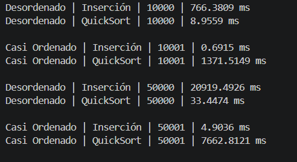
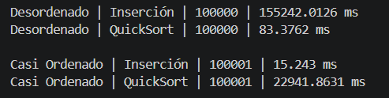

# Práctica 4 - Comparación de Algoritmos de Ordenamiento

## Resultados Obtenidos

### Tabla 1: Escenario 1 - Arreglo completamente desordenado

| Tamaño de muestra | Tiempo Inserción | Tiempo QuickSort | Algoritmo más rápido | Observación |
|-------------------|-----------------|-----------------|---------------------|-------------|
| 10.000 | 766.3809 ms | 8.9559 ms | QuickSort | QuickSort fue más rápido |
| 50.000 | 20919.4926 ms | 33.4474 ms | QuickSort | La diferencia aumenta drásticamente |
| 100.000 | 155242.0126 ms | 83.3762 ms | QuickSort | Inserción se vuelve inviable |

### Tabla 2: Escenario 2 - Arreglo ordenado más una nueva persona

| Tamaño de muestra | Tiempo Inserción | Tiempo QuickSort | Algoritmo más rápido | Observación |
|-------------------|-----------------|-----------------|---------------------|-------------|
| 10.001 | 0.6915 ms | 1371.5149 ms | Inserción | Inserción es más rápida |
| 50.001 | 4.9036 ms | 7662.8121 ms | Inserción | La ventaja de Inserción crece |
| 100.001 | 15.243 ms | 22941.8631 ms | Inserción | QuickSort se vuelve inviable |

---

## Análisis

**¿Qué algoritmo fue más rápido en el escenario desordenado?**  
QuickSort fue significativamente más rápido en todos los tamaños.

**¿Qué algoritmo fue más rápido en el escenario casi ordenado?**  
Inserción fue mucho más rápido.

**¿El crecimiento del tamaño de muestra afectó por igual a los dos algoritmos?**  
No porque inserción en el escenario desordenado creció de forma cuadrática, pasando de 766 ms a 155.242 ms al multiplicar por 10 el tamaño mientras que quickSort creció de forma mucho más lenta, de 8 ms a 83 ms en el mismo caso.

**¿Por qué Inserción puede mejorar cuando el arreglo ya está casi ordenado?**  
Porque Inserción revisa elemento por elemento y cuando el arreglo ya está ordenado cada elemento casi no necesita desplazarse haciendo muy pocas comparaciones por iteración.

**¿Por qué QuickSort suele ser mejor cuando los datos están muy desordenados?**  
Porque divide el arreglo en mitades y ordena cada parte independientemente, reduciendo el número total de comparaciones necesarias respecto a Inserción que compara cada elemento con todos los anteriores.

---

## Conclusiones

- **Conclusión 1:**
Cuando los datos estuvieron totalmente desordenados quiksort resulto ser mucho mas eficiente ya que con 100.000 datos apenas tardo 83 ms mientras que insercion hizo 155242 ms y esta diferencia sigue creciendo mientras mas grande sea la cantidad de datos.

- **Conclusión 2:**
Por otra parte cuando se trata de el escenario con los datos casi ordenados insercion se vuelve mucho mas eficiente porque con 100.001 datos tardo 15 ms mientras que quicksort 22941 ms, permitiendonos notar que insercion aprovecha que el arreglo ya esta ordenado hacaiendo minimos cambios y tardando menos tiempo.

- **Conclusión 3:**
La verdad que en cuanto a escoger el algoritmo correcto no se puede como tal porque depende mucho del estado de los datos ya que como vimos segun los resultados obtenidos quicksort es mucho mejor para datos desordenados mientras que insercion es mas eficiente para datos casi ordenados, mostrando que dependiendo del metodo escogido puede haber una diferencia de milisegundos y minutos.
## RESULTADOS OBTENIDOS

